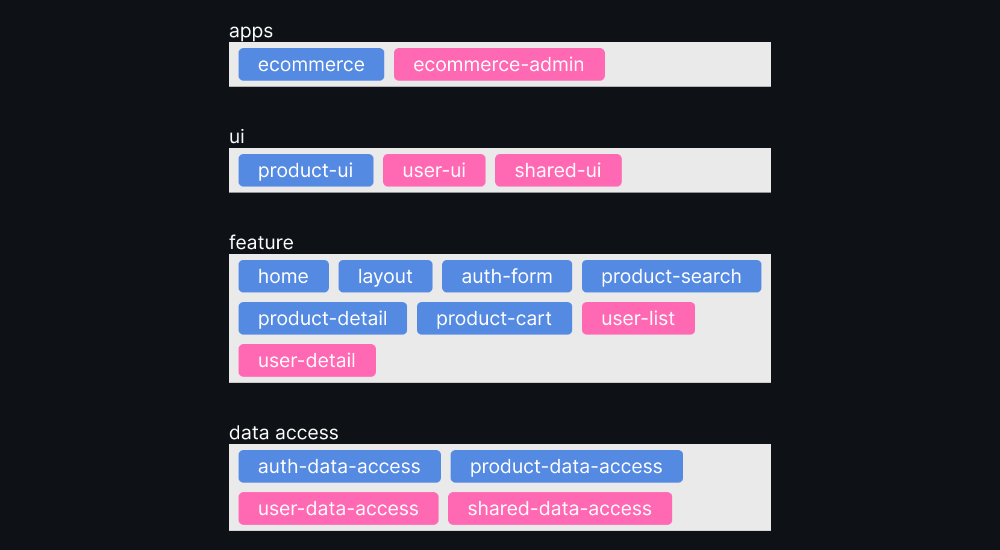

# e-Commerce & Admin

    

Este repositório contém os entregáveis para conclusão da Mentoria Angular Pro 2.0 de Andrew Rosário e Paolo Almeida.

Trata-se de um sistema de e-commerce composto por lista, busca e detalhes de produtos e uma tela de administração de usuários.

## Tecnologias

As aplicações foram criadas utilizando Angular 17, Angular Material e Nx. Trata-se de um monorepo contendo duas aplicações: o site de e-commerce (versão cliente) e um painel administrativo.

## Versões publicadas

-   Site de e-commerce: [https://mentoria-site.vercel.app](https://mentoria-site.vercel.app)
-   Painel administrativo: [https://mentoria-admin.vercel.app](https://mentoria-admin.vercel.app)

## Setup

Ao clonar o repositório, instale as dependências com o comando:

```bash
npm install
```

## Execução

Para executar o site de e-commerce (versão cliente), utilize o comando:

```bash
nx serve ecommerce
```

Para executar o painel administrativo, utilize o comando:

```bash
nx serve ecommerce-admin
```

## Desenvolvimento

Para organizar as tarefas do projeto, utilizamos [este quadro no Trello](https://trello.com/b/YTLXlro8/mentoria-angular).

A arquitetura do projeto e suas respectivas bibliotecas estão representadas no diagrama abaixo:



Os itens em rosa foram adicionados ao projeto original para atender aos requisitos do trabalho de conclusão. São eles:

-   user-data-access: biblioteca para acesso a dados de usuários
-   shared-data-access: models de definição da paginação e ordenação de listas
-   user-list: componente para listagem de usuários
-   user-details: componente para detalhes de usuários
-   user-ui: componentes de interface para tabela de usuários e view de perfil de usuário
-   shared-ui: contém a tradução para português do paginator do Angular Material
-   ecommerce-admin: aplicação com o painel administrativo

Este projeto foi desenvolvido por [Vanessa Ortega](https://github.com/ortegavan) e [Agemiro Alves](https://github.com/agemiro).
